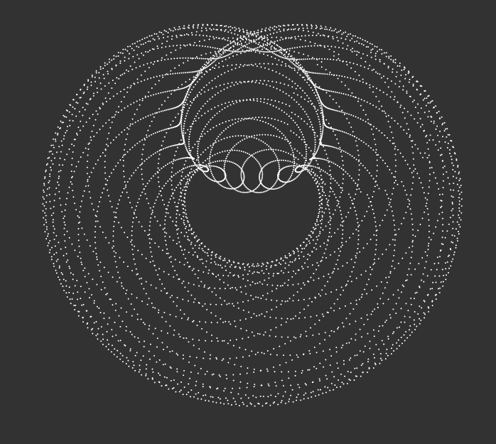

# About Time

### Space and Time is An Illusion

In this exercise, I continue to explore the magical power of periodic functions. I want to illustrate that space and time is an illusion, and has an organic and fluid nature.

My idea starts off by creating sin waves on a polar coordinate system and then adding another layer of waves. I further tweak the visual effect so the spinning sphere looks like earth, and the oscillating waves are dimentional space and time that pass through us.

Finally, I add in a frequency slider to showcase the visual variations. The animation is tied to `frameCount`.
 

 
**[Open Processing](https://openprocessing.org/sketch/1584180)**
